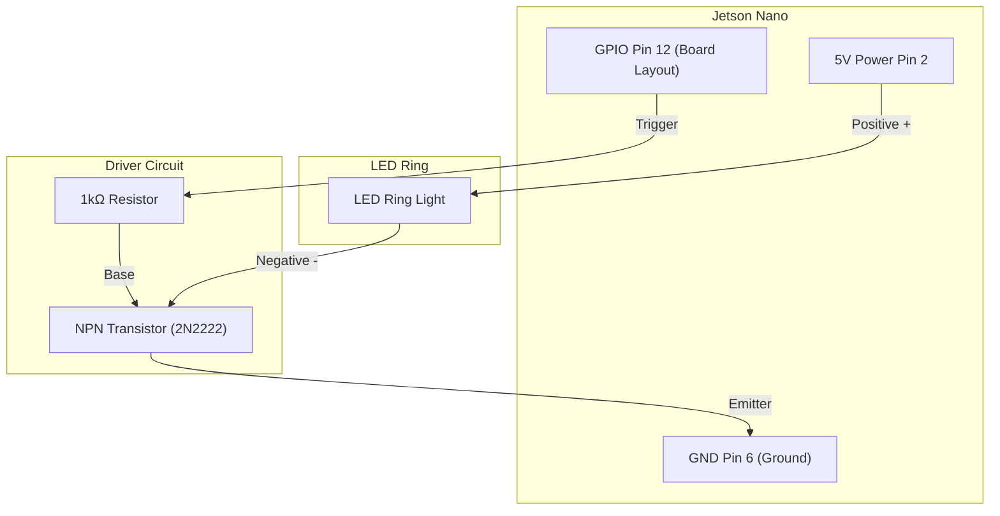

# Setup Guide: Skin Cancer Edge Inference & Federated Learning on Jetson Nano (4GB)

This document provides step-by-step instructions to configure, wire, provision, and deploy the Federated Skin Cancer Classification dashboard on the **NVIDIA Jetson Nano (4GB Developer Kit)**.

---

## 1. Hardware Bill of Materials (BOM) & Specifications

1.  **SBC**: NVIDIA Jetson Nano (4GB B01 Developer Kit)
2.  **Display**: 7-inch Touchscreen Display (HDMI input, USB interface for capacitive touch)
3.  **Camera**: USB Dermoscope or Raspberry Pi Camera Module V2 (CSI connector)
4.  **Illumination**: LED Ring Light (5V)
5.  **Power Supply**: 5V 4A DC Power Supply (Barrel Jack, 2.1mm ID / 5.5mm OD)
6.  **Storage**: 32GB or 64GB High-Speed MicroSD Card (UHS-I Class 10 recommended)
7.  **Peripherals**: Keyboard and Mouse (for initial setups), NPN Transistor (e.g., 2N2222) or Relay module, 1kΩ Resistor.

---

## 2. Hardware Assembly & Configuration

### A. Crucial Power Configuration (J48 Jumper)
Running the Jetson Nano, its GPU, the 7-inch display (if powered via Jetson's USB), and the LED ring light will exceed the micro-USB power input limit (5V 2A). **You must use a 5V 4A Barrel Jack power supply.**

> [!WARNING]
> To enable the DC barrel jack and disable micro-USB power, **you must short the J48 Jumper pins** on the carrier board.
> *   Locate the two-pin header marked **J48** (positioned near the barrel jack connector).
> *   Place a standard jumper shunt block over both pins.
> *   Connect the 5V 4A DC power supply to the barrel jack.

### B. LED Ring Light GPIO Control Wiring
The Jetson Nano's 40-pin header GPIO pins output a maximum of **20mA** at 3.3V. The LED Ring Light draws **100mA to 500mA+**, which will burn out the Jetson's GPIO pin if connected directly. 

**You must use a simple driver circuit (such as a 2N2222 NPN Transistor or a Relay Module):**



#### Detailed Connections:
1.  Connect **Jetson Pin 2 (5V)** to the **LED Ring (+)** terminal.
2.  Connect **Jetson Pin 6 (GND)** to the **Transistor Emitter (E)**.
3.  Connect **Jetson Pin 12 (GPIO 18 / Board Pin 12)** to a **1kΩ Resistor**. Connect the other end of the resistor to the **Transistor Base (B)**.
4.  Connect **LED Ring (-)** terminal to the **Transistor Collector (C)**.

### C. Touchscreen & USB Dermoscope Connections
*   Connect the **HDMI Cable** from the Jetson HDMI output to the Touchscreen's HDMI input.
*   Connect the **Micro-USB to USB-A Cable** from the Touchscreen's touch port to one of the Jetson Nano's USB ports (this provides power and registers touch coordinates).
*   Connect the **USB Dermoscope** to another available Jetson USB port.

---

## 3. MicroSD Card OS Preparation

1.  Download the official [NVIDIA Jetson Nano Developer Kit SD Card Image](https://developer.nvidia.com/embedded/downloads) (JetPack 4.6.x containing Ubuntu 18.04 LTS is standard).
2.  Insert the MicroSD card (32GB/64GB) into your host PC.
3.  Flash the image onto the card using **BalenaEtcher** or **Rufus**.
4.  Insert the card into the MicroSD slot under the Jetson Nano module.
5.  Power on, complete the Ubuntu configuration wizard, and connect to Wi-Fi.

---

## 4. Software Provisioning & Dependencies

Open a terminal on the Jetson Nano.

### A. Setup GPIO Permissions
To allow the Python application to access the GPIO pins without running as root (`sudo`):
```bash
# 1. Create the gpio group (usually pre-existing)
sudo groupadd -f -r gpio

# 2. Add your current user to the gpio group
sudo usermod -a -G gpio $USER

# 3. Apply udev rule configuration
sudo cp /opt/nvidia/jetson-gpio/etc/99-gpio.rules /etc/udev/rules.d/

# 4. Reload rules (or reboot)
sudo udevadm control --reload-rules && sudo udevadm trigger
```

### B. Installing PyTorch with CUDA for ARM64
Standard `pip install torch` downloads CPU-only packages for ARM64. **You must install NVIDIA's official PyTorch wheels** compiled for CUDA on Jetson:

```bash
# 1. Install system prerequisites
sudo apt-get update
sudo apt-get install -y libopenblas-base libopenmpi-dev libjpeg-dev zlib1g-dev

# 2. Setup python pip
sudo apt-get install -y python3-pip
pip3 install --upgrade pip

# 3. Install PyTorch wheel (for Python 3.6 / JetPack 4.6)
# Check official links: https://forums.developer.nvidia.com/t/pytorch-for-jetson/72048
wget https://nvidia.box.com/shared/static/p57jw14tk1vbka5pwa9t7296jszo14cx.whl -O torch-1.10.0-cp36-cp36m-linux_aarch64.whl
pip3 install torch-1.10.0-cp36-cp36m-linux_aarch64.whl

# 4. Install Torchvision compatible wheel
git clone --branch v0.11.1 https://github.com/pytorch/vision torchvision
cd torchvision
export BUILD_VERSION=0.11.1
python3 setup.py install --user
cd ..
```

### C. Install Project Dependencies
Run this in the root of the cloned project folder:
```bash
# Install other necessary Python packages
pip3 install -r requirements.txt
pip3 install flask psutil
```

---

## 5. Execution Workflow

### A. Preparing the Trained Model
Before running the dashboard, ensure you have a trained model checkpoint. You can run centralized training locally first or download/transfer a checkpoint:
```bash
# Place your model in the checkpoints folder
mkdir -p checkpoints
# Save or rename your weights as: checkpoints/centralized_best.pt
```

### B. Launching the App
Run the automation launch script:
```bash
chmod +x run_jetson_gui.sh
./run_jetson_gui.sh
```

This script:
1.  Launches the local Flask backend server (`http://localhost:5000`).
2.  Monitors when port 5000 is open.
3.  Loads Chromium in fullscreen **Kiosk Mode** on the 7-inch display, disabling screensavers.

---

## 6. How the 16-Step Diagnostic Workflow Maps to the UI

*   **Capture Input (Steps 7–8)**: The user clicks the **Capture & Diagnose** button. The server triggers the NPN transistor to turn the LED Ring Light ON. OpenCV captures the video frame and the LED turns OFF.
*   **Edge Inference (Steps 9–10)**: The Flask backend resizes the frame to 128x128, standardizes it via ImageNet mean/std, and processes it on the Maxwell GPU using CUDA.
*   **Explainability Overlay (Step 11)**: Grad-CAM extracts activations from the final convolutional block of MobileNetV3 and generates a jet-colormap heatmap.
*   **Result Render (Step 12)**: The touchscreen refreshes, displaying the predicted label, confidence metrics, and interactive tabs comparing the capture, heatmap, and overlay side-by-side.
*   **Federated Round (Steps 13–16)**: The user opens the "Federated Node System" panel, selects the Client ID, and clicks **Participate in FL Round**. The application launches the Flower Client in the background, training locally using the dataset on the microSD card and transmitting only the weights updates. The local weights are automatically reloaded when a round finishes.
